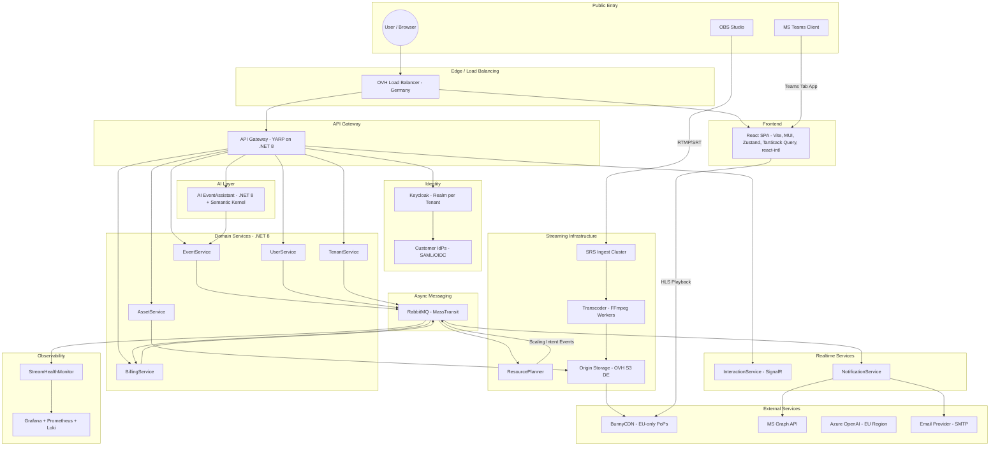
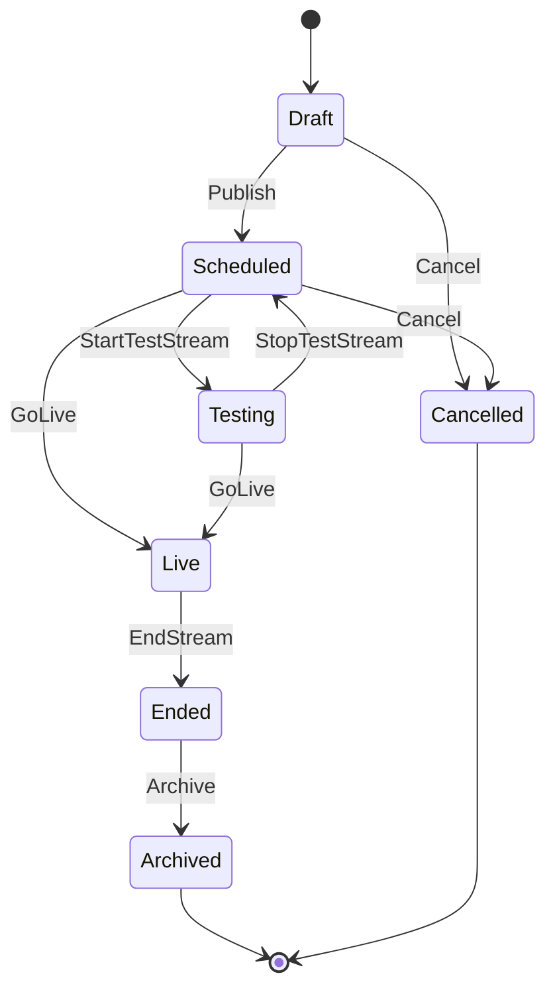
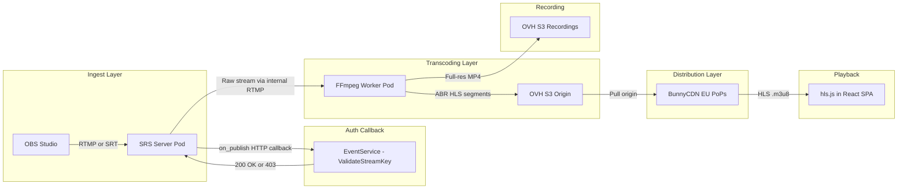
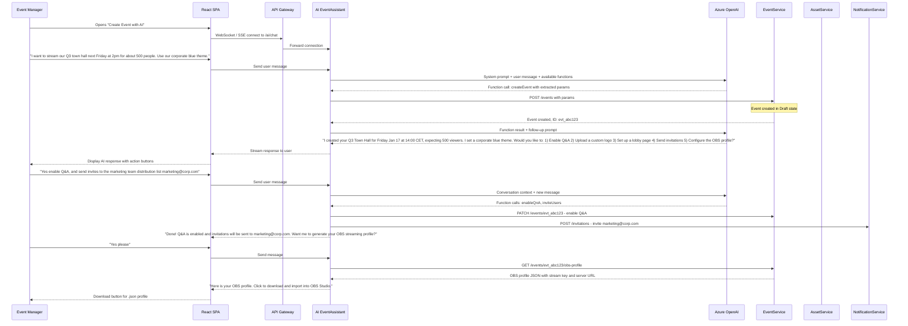
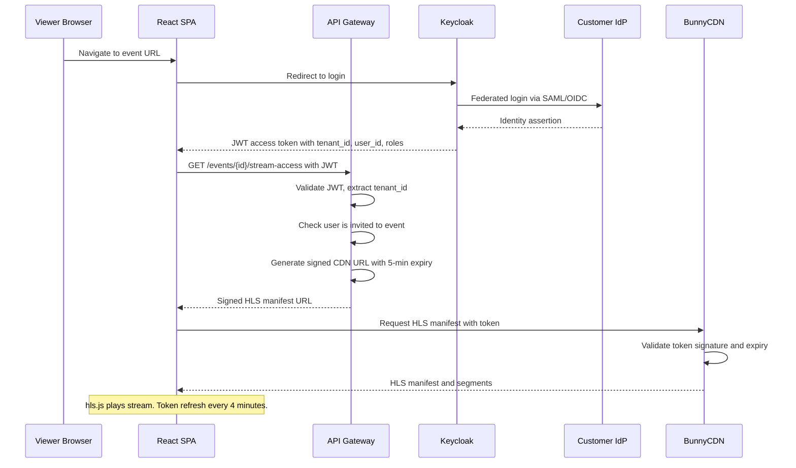
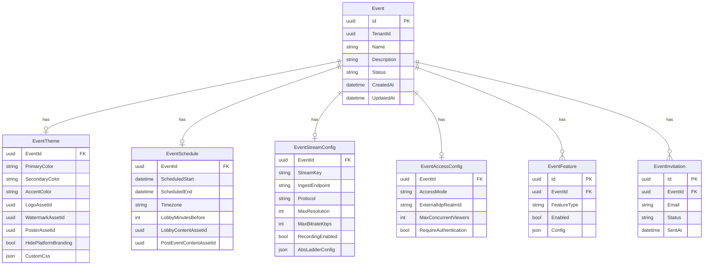
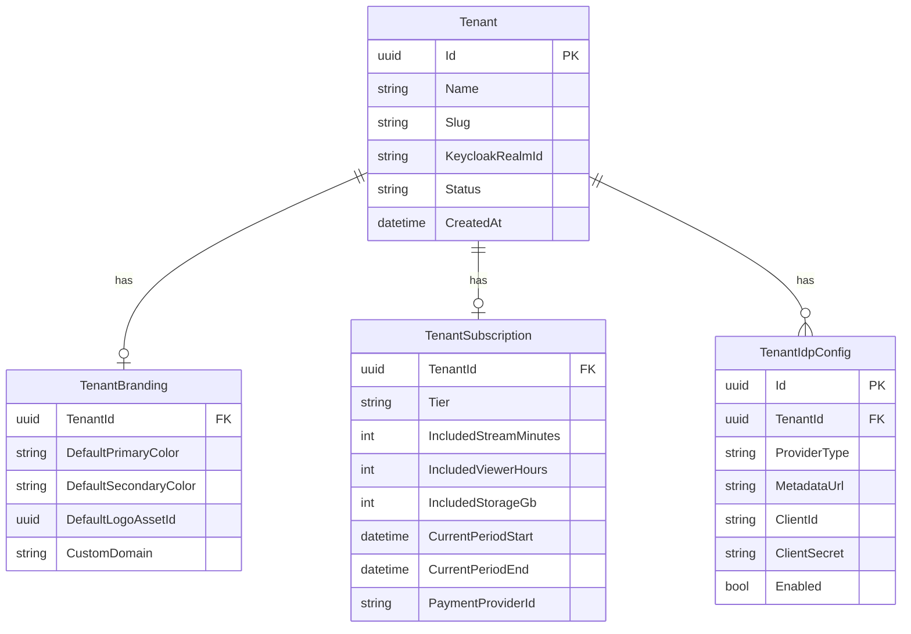

# TerraStream Platform -- Revised Architecture Plan

---

## 1. Platform Vision

TerraStream is a multi-tenant, cloud-native corporate live streaming platform hosted in Germany. It enables event managers to create, customize, stream, and analyze live video events for their organizations -- with minimal technical expertise required.

---

## 2. High-Level Architecture



---

## 3. Service Decomposition

### 3.1 API Gateway (YARP on .NET 8)

- **Responsibility:** Route requests, rate limiting, JWT validation, tenant resolution from token claims, CDN signed URL generation.
- **Key detail:** Does NOT contain business logic. Purely infrastructure. Uses YARP (Yet Another Reverse Proxy) for .NET-native reverse proxying.
- **Tenant resolution:** Every authenticated request carries a `tenant_id` claim from Keycloak. The gateway injects this as a header for downstream services.

### 3.2 EventService

- **Responsibility:** Event lifecycle management (CRUD, state machine), event configuration, stream key generation, OBS profile generation.
- **Database:** PostgreSQL (own schema, `event_db`)
- **Publishes events:** `EventCreated`, `EventScheduled`, `EventStarted`, `EventEnded`, `EventArchived`, `StreamKeyGenerated`
- **Patterns:** CQRS with MediatR. Write model validates and persists. Read model serves denormalized views via TanStack Query-friendly endpoints.

**Event State Machine:**



### 3.3 UserService

- **Responsibility:** User profiles, organization membership, event access lists, viewer session tracking.
- **Database:** PostgreSQL (`user_db`)
- **Key detail:** Does NOT duplicate Keycloak identity data. Stores platform-specific user metadata (display name preferences, notification settings, event history).

### 3.4 TenantService

- **Responsibility:** Customer/organization onboarding, subscription tier management, default branding, IdP configuration, feature entitlements.
- **Database:** PostgreSQL (`tenant_db`)
- **Publishes events:** `TenantOnboarded`, `SubscriptionChanged`, `TenantSuspended`
- **Key detail:** When a new tenant is onboarded, this service triggers Keycloak realm creation and default IdP setup via events.

### 3.5 AssetService

- **Responsibility:** File uploads (logos, watermarks, poster images, recordings), presigned upload URLs, asset metadata, virus scanning.
- **Storage:** OVH Object Storage (S3-compatible), region `de-fra1` (Frankfurt).
- **Key detail:** Assets are uploaded directly from the browser to S3 via presigned URLs. The AssetService only manages metadata and generates the URLs. This avoids routing large files through the API.

### 3.6 BillingService

- **Responsibility:** Usage metering (stream minutes, viewer-hours, storage), subscription management, invoice generation, payment provider integration.
- **Consumes events:** `EventStarted`, `EventEnded`, `ViewerSessionStarted`, `ViewerSessionEnded`
- **Key detail:** Calculates cost based on: event duration x peak concurrent viewers x quality tier. Supports both pay-per-event and monthly subscription with included quotas.

### 3.7 InteractionService (SignalR Hub)

- **Responsibility:** Real-time Q&A, emoji reactions, live viewer count, moderator controls.
- **Technology:** ASP.NET Core SignalR with Redis backplane for horizontal scaling.
- **Key detail:** This is the highest-throughput service during live events. It must be independently scalable. Messages are ephemeral (in-memory + Redis), with periodic snapshots to PostgreSQL for post-event analytics.

### 3.8 NotificationService

- **Responsibility:** Email invitations, MS Teams meeting creation, push notifications, event reminders.
- **Consumes events:** `EventScheduled`, `UserInvited`, `EventStarting` (15 min before), `EventEnded`
- **MS Teams integration:** Uses Microsoft Graph API to create online meetings with a custom Teams Tab app URL as the join link. The tab embeds the TerraStream SPA.

### 3.9 AI EventAssistant

- **Responsibility:** Natural language event configuration via chat interface.
- **Technology:** .NET 8 + Semantic Kernel with Azure OpenAI (hosted in EU region for GDPR).
- **Architecture:** Described in full in Section 5 below.

### 3.10 ResourcePlanner

- **Responsibility:** Capacity management. Reacts to event schedules and expected viewer counts to pre-scale streaming infrastructure.
- **Consumes events:** `EventScheduled` (with expected viewer count), `EventCancelled`
- **Key detail:** Does NOT directly call the Kubernetes API. Instead, it writes scaling intents to a CRD (Custom Resource Definition). A Kubernetes Operator (or KEDA ScaledObject) watches the CRD and performs the actual scaling. This is the safe operator pattern.

### 3.11 StreamHealthMonitor

- **Responsibility:** Monitors active streams for bitrate drops, frame loss, encoder disconnects. Publishes `StreamHealthDegraded` and `EncoderDisconnected` events.
- **Feeds into:** Grafana dashboards for admin monitoring, and real-time status updates to the event manager via SignalR.

---

## 4. Streaming Pipeline

This is the most critical infrastructure component. The pipeline handles ingest from OBS, transcodes to adaptive bitrate, stores at origin, and serves via CDN.



### 4.1 Ingest: SRS (Simple Realtime Server)

- **Why SRS over NGINX-RTMP:** SRS is actively maintained (MIT license), supports RTMP + SRT + WebRTC + HLS natively, has built-in `on_publish` HTTP callbacks for stream key validation, and provides stream statistics APIs.
- **Deployment:** Shared ingest pool (3+ pods by default), scaled by ResourcePlanner based on concurrent stream count.
- **Auth flow:** When OBS connects, SRS calls `POST /api/streams/validate` on EventService with the stream key. EventService verifies the key matches an active event in `Scheduled` or `Testing` state and returns 200 or 403.

### 4.2 Transcoding: FFmpeg Workers

- **ABR ladder (default):**

| Quality | Resolution | Bitrate | Framerate |

|---|---|---|---|

| Source | Passthrough | Passthrough | Passthrough |

| High | 1080p | 5000 kbps | 30 fps |

| Medium | 720p | 2500 kbps | 30 fps |

| Low | 480p | 1000 kbps | 30 fps |

| Audio-only | - | 128 kbps | - |

- **Output format:** HLS with 2-second segments for low-latency, or 6-second segments for standard. LL-HLS with partial segments when BunnyCDN edge supports it.
- **Deployment:** Kubernetes Jobs/Pods spun up per active stream. GPU nodes optional for hardware-accelerated encoding (NVENC).

### 4.3 CDN: BunnyCDN

- **Configuration:** Pull zone configured with OVH S3 as origin. EU-only PoPs enabled. Token authentication enabled on the pull zone.
- **Signed URLs:** The API Gateway generates short-lived (5-minute) signed URLs for each viewer session. The token is validated by BunnyCDN at the edge. URL includes: expiry timestamp, user hash, event ID.
- **Cache behavior:** HLS segments cached at edge for the segment duration. Manifest files (.m3u8) NOT cached (or cached for 1 second) to ensure viewers get the latest segment list.

### 4.4 Recording and VoD

- The FFmpeg worker simultaneously writes the full-resolution stream to S3 as a single MP4 file.
- When `EventEnded` fires, a post-processing job generates a final VoD HLS package (with same ABR ladder) and stores it in S3.
- VoD playback uses the same BunnyCDN pull zone with a different path prefix (`/vod/{eventId}/`).

---

## 5. AI-Assisted Event Creation Journey

### 5.1 Architecture



### 5.2 AI EventAssistant -- Technical Design

**Framework:** .NET 8 + Microsoft Semantic Kernel

**LLM Provider:** Azure OpenAI (GPT-4o), deployed in `swedencentral` or `francecentral` region (closest EU regions with Azure OpenAI availability). Data does NOT leave the EU.

**System Prompt (core):**

```
You are the TerraStream Event Assistant. You help event managers create and configure 
live streaming events. You have access to the following capabilities:
- Create events with name, date, time, expected viewers, and theme
- Configure event features (Q&A, reactions, chat, analytics)
- Set branding (colors, logo, watermark) 
- Manage invitations (email, distribution lists)
- Configure video quality and streaming settings
- Generate OBS Studio profiles
- Schedule test streams

Always confirm critical details (date, time, viewer count) before creating. 
Use the tenant's default branding if no specific branding is requested.
Respond in the user's language.
```

**Available Functions (exposed to LLM via function calling):**

| Function | Parameters | Description |

|---|---|---|

| `createEvent` | name, dateTime, timezone, expectedViewers, description | Creates a new event in Draft state |

| `updateEventSettings` | eventId, features (q&a, chat, reactions, analytics) | Toggles event features |

| `setEventBranding` | eventId, primaryColor, secondaryColor, accentColor | Sets theme colors |

| `uploadAssetIntent` | eventId, assetType (logo, watermark, poster) | Returns a presigned upload URL for the user |

| `inviteUsers` | eventId, emails[], distributionLists[] | Sends invitations |

| `setEventSchedule` | eventId, startTime, endTime, timezone, lobbyMinutesBefore | Sets schedule details |

| `setVideoQuality` | eventId, maxResolution, maxBitrate | Configures stream quality |

| `generateObsProfile` | eventId | Returns OBS profile download URL |

| `publishEvent` | eventId | Moves event from Draft to Scheduled |

| `scheduleTestStream` | eventId, testDateTime | Schedules a test stream window |

**Conversation persistence:** Each AI conversation is stored with its event context. If the user returns later, the assistant has full history and can continue configuration.

### 5.3 Full AI-Assisted User Journey

1. **Entry:** Event manager clicks "Create Event with AI" or navigates to the AI assistant panel.
2. **Natural language input:** User describes the event in plain language. Can be as terse as "town hall next Friday, 200 people" or as detailed as a full brief.
3. **AI extracts parameters:** The LLM parses intent and calls the appropriate functions. It asks clarifying questions if critical info is missing (e.g., "What time zone should I use?").
4. **Iterative configuration:** The AI presents what it has configured and offers next steps. The user can refine via conversation ("make the theme darker", "change to 4pm instead").
5. **Preview:** At any point the user can say "show me a preview" -- the AI generates a link to the event lobby preview page.
6. **OBS profile download:** User requests the OBS profile. The system generates a JSON file with:

   - RTMP server URL: `rtmp://ingest.terrastream.de/live`
   - Stream key: `evt_abc123_sk_xxxx`
   - Encoding preset: Matched to the configured quality
   - Audio settings: AAC, 128kbps

7. **Test stream:** User opens OBS, imports the profile, and starts a test stream. The AI (or the event dashboard) shows a live preview player. Only the event manager can see the test stream.
8. **Go live:** On event day, the user opens OBS with the same profile and clicks "Start Streaming." The EventService transitions the event to `Live`. The ResourcePlanner has already pre-scaled the infrastructure based on the expected viewer count.
9. **During event:** Viewers join via the shared link or MS Teams tab. Q&A and reactions flow through the InteractionService. The StreamHealthMonitor tracks quality.
10. **Post-event:** The AI sends a summary: "Your Q3 Town Hall had 487 viewers with a peak of 512. 23 Q&A questions were asked. The recording is ready -- shall I share it with all invitees?"

---

## 6. Security Model

### 6.1 Authentication and Authorization Flow



### 6.2 Security Layers Summary

| Layer | Mechanism |

|---|---|

| **User authentication** | Keycloak with per-tenant realms, federated to customer SAML/OIDC IdPs |

| **API authorization** | JWT bearer tokens, role-based (Admin, EventManager, Viewer), tenant-scoped |

| **Stream ingest auth** | `on_publish` callback validates stream key against EventService |

| **CDN playback auth** | BunnyCDN token authentication with expiring signed URLs |

| **Data at rest** | S3 server-side encryption (SSE-S3), database encryption (PostgreSQL TDE) |

| **Data in transit** | TLS everywhere (HTTPS, RTMPS/SRT encryption, WSS for SignalR) |

| **Sensitive stream tier** | Optional: Widevine/FairPlay DRM for customers requiring it (premium feature) |

| **GDPR** | All data stored in Germany/EU. CDN restricted to EU PoPs. Azure OpenAI in EU region. Data processing agreements with all sub-processors. |

---

## 7. Multi-Tenancy Strategy

| Concern | Strategy |

|---|---|

| **Identity** | One Keycloak realm per tenant. Full IdP isolation. Each realm has its own client IDs, federated IdP configs, and user pools. |

| **Application data** | Shared PostgreSQL instances, separate schemas per service, `tenant_id` column on every table. Row-Level Security (RLS) policies in PostgreSQL enforce isolation at the DB level. |

| **Streaming** | Shared ingest pool with stream-key-based routing. Logical isolation (separate HLS output paths per tenant/event). No cross-tenant data leakage possible because paths are: `/hls/{tenantId}/{eventId}/`. |

| **Storage** | Shared S3 bucket with prefix-based isolation: `/{tenantId}/assets/`, `/{tenantId}/recordings/`. IAM policies enforce prefix restrictions. |

| **CDN** | Single BunnyCDN pull zone. Token includes tenant_id to prevent cross-tenant URL guessing. |

| **Billing** | Per-tenant usage metering. Each tenant has a subscription tier with quotas. Overage is tracked and billed. |

---

## 8. Database Design (per service)

### 8.1 EventService Database



### 8.2 TenantService Database



---

## 9. Technology Stack Summary

| Layer | Technology | Justification |

|---|---|---|

| **Frontend** | React 18, Vite, MUI 6, Zustand, TanStack Query, react-intl, hls.js | Modern, fast, well-supported. hls.js for adaptive playback. |

| **API Gateway** | YARP on .NET 8 | Native .NET reverse proxy, no need for separate infrastructure like Kong. |

| **Backend services** | .NET 8, MediatR, FluentValidation, EF Core | CQRS via MediatR. Factory pattern for entity creation. |

| **Realtime** | ASP.NET Core SignalR + Redis backplane | Built-in .NET WebSocket abstraction. Redis for multi-pod fan-out. |

| **AI** | Semantic Kernel + Azure OpenAI GPT-4o | Microsoft-native LLM orchestration for .NET. Function calling for structured actions. |

| **Identity** | Keycloak (Quarkus) | Mature, supports SAML/OIDC brokering, realm-per-tenant, themeable login pages. |

| **Message broker** | RabbitMQ via MassTransit | MassTransit abstracts the broker. Start with RabbitMQ (simple). Swap to Kafka via config if needed later. |

| **Streaming ingest** | SRS (Simple Realtime Server) | Active OSS, RTMP + SRT, HTTP callbacks, statistics API. |

| **Transcoding** | FFmpeg | Industry standard. Run as K8s Jobs per stream. |

| **CDN** | BunnyCDN (EU PoPs) | Cost-effective, LL-HLS support, token auth, Germany PoPs. |

| **Storage** | OVH Object Storage (S3-compat, Frankfurt) | German hosting. S3-compatible API. |

| **Database** | PostgreSQL 16 | Reliable, supports RLS for multi-tenancy, JSON columns for flexible config. |

| **Cache** | Redis | SignalR backplane, session cache, rate limiting. |

| **Observability** | Grafana + Prometheus + Loki + OpenTelemetry | Full stack: metrics, logs, traces, dashboards. |

| **Container orchestration** | Kubernetes (OVH Managed K8s) | Managed K8s in Germany. |

| **CI/CD** | GitHub Actions | Pipelines per service repo. Docker build, push to registry, Helm deploy. |

| **IaC** | Terraform + Helm | Terraform for cloud resources, Helm charts for K8s deployments. |

---

## 10. Repository Structure

```
terrastream/
  terrastream-frontend/          # React SPA
  terrastream-api-gateway/       # YARP gateway
  terrastream-event-service/     # Event domain
  terrastream-user-service/      # User domain
  terrastream-tenant-service/    # Tenant/org domain
  terrastream-asset-service/     # File/blob management
  terrastream-billing-service/   # Usage metering and billing
  terrastream-interaction-service/ # SignalR hub for Q&A/reactions
  terrastream-notification-service/ # Email, Teams, push
  terrastream-ai-assistant/      # Semantic Kernel AI service
  terrastream-resource-planner/  # Capacity management
  terrastream-stream-monitor/    # Stream health monitoring
  terrastream-k8s-operator/      # Custom operator for scaling CRDs
  terrastream-infra/             # Terraform + Helm charts
  terrastream-shared/            # Shared NuGet packages (contracts, events, DTOs)
  terrastream-docs/              # This repo - architecture docs
```

---

## 11. MS Teams Integration

The MS Teams integration works as a **Teams Tab App:**

1. **NotificationService** creates a Teams meeting via Microsoft Graph API when an event manager requests it.
2. The meeting join URL points to a Teams Tab that loads the TerraStream SPA in an iframe.
3. Viewers in Teams see the high-quality HLS stream inside the TerraStream player (not degraded Teams video).
4. Q&A and reactions work natively within the embedded SPA.
5. **Registration:** The Teams App must be registered in Microsoft Partner Center and deployed to the customer's Teams admin center (or published to the Teams App Store).

---

## 12. OBS Profile Generation

When an event manager requests an OBS profile, EventService generates a JSON file:

```json
{
  "settings": {
    "stream": {
      "type": "rtmp_custom",
      "server": "rtmp://ingest.terrastream.de/live",
      "key": "evt_abc123_sk_7f8a9b2c"
    },
    "output": {
      "mode": "Advanced",
      "streaming": {
        "encoder": "x264",
        "rate_control": "CBR",
        "bitrate": 5000,
        "keyint_sec": 2
      }
    },
    "video": {
      "base_res": "1920x1080",
      "output_res": "1920x1080",
      "fps_type": "Common FPS Values",
      "fps_common": 30
    },
    "audio": {
      "sample_rate": 48000,
      "channels": "Stereo"
    }
  }
}
```

- Delivered as a downloadable `.json` file or via a `obs://` deep link (if OBS supports it on the user's platform).
- The stream key is unique per event and validated server-side on ingest.

---

## 13. Implementation Phases

### Phase 1 -- MVP (Months 1-3)

- EventService (CRUD, state machine, stream key generation)
- TenantService (basic onboarding)
- UserService (profiles, event access)
- Keycloak setup (single realm for testing, basic OIDC)
- React SPA (event management dashboard, HLS player)
- SRS ingest with on_publish auth
- FFmpeg transcoding (single quality for MVP)
- BunnyCDN integration with token auth
- Basic OBS profile download
- RabbitMQ + MassTransit messaging

### Phase 2 -- Core Features (Months 4-6)

- Multi-tenant Keycloak (realm-per-tenant)
- InteractionService (Q&A, reactions via SignalR)
- NotificationService (email invitations)
- ABR transcoding (full quality ladder)
- Recording and VoD playback
- AssetService (logo/watermark uploads)
- Event branding/theming in SPA
- Lobby page with countdown
- ResourcePlanner with KEDA scaling

### Phase 3 -- Premium Features (Months 7-9)

- AI EventAssistant (Semantic Kernel + Azure OpenAI)
- MS Teams Tab App integration
- BillingService (usage metering, Stripe integration)
- External IdP federation (SAML/OIDC brokering)
- Grafana monitoring dashboards
- StreamHealthMonitor
- Multi-language audio tracks
- Custom domains per tenant

### Phase 4 -- Scale and Polish (Months 10-12)

- DRM for sensitive streams (Widevine/FairPlay)
- SRT ingest support
- Advanced analytics (viewer heatmaps, engagement scores)
- White-label / full CI customization
- Free test stream tier
- Public API for integrations
- Load testing and performance optimization